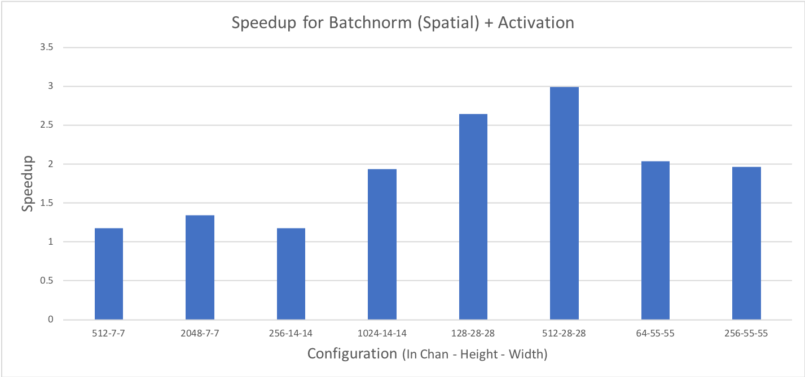

Supported fusions 
-------------------

The tables below outlines the supported fusions for fp32 and fp16 as well as any applicable constraints. **(C = convolution, B = bias, N = batch normalization, A = activation)**
Fusion Plans with grouped convolutions are not supported.

.. image:: ../data/how-to/fp32fusions.png

.. image:: ../data/how-to/fp16fusions.png

Performance comparison to non-fused kernels
===========================================

The following graph depicts the speedup gained for a fused Convolution+Bias+Activation over a non-fused version, all configurations have a batch size of 64:

.. image:: ../data/how-to/cba.png

Speedup obtained by fusing Batchnorm (spatial mode) with Activation are presented in the graph below:

