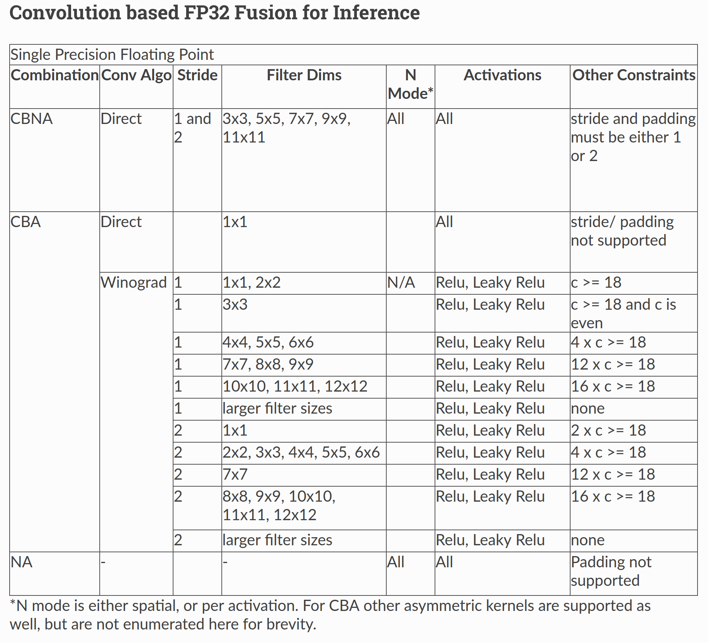
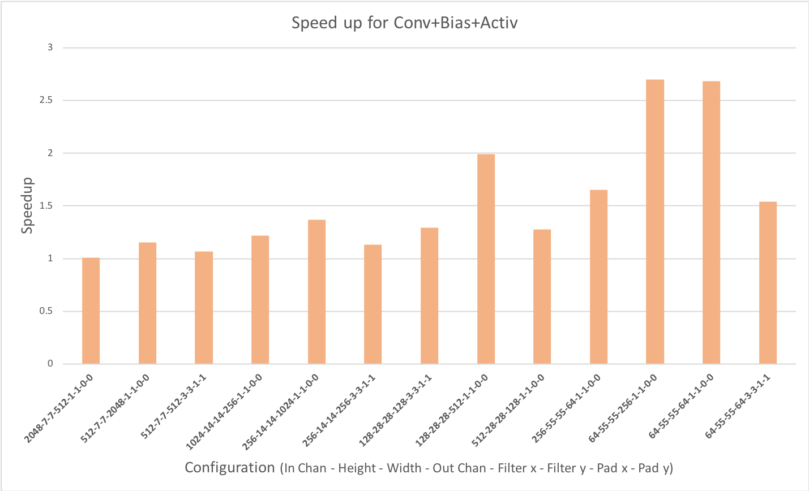
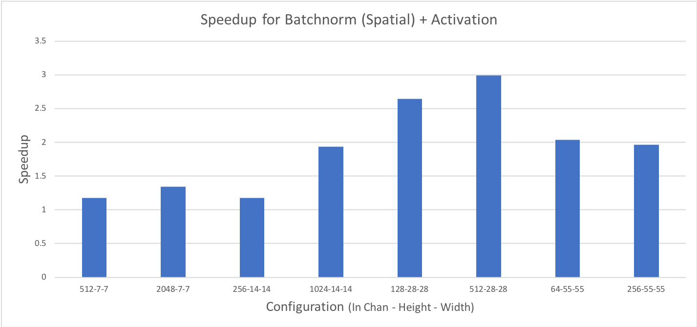

.. meta::
  :description: Using the Fusion API
  :keywords: MIOpen, ROCm, API, documentation, fusion API

************************************************************************************************
Using the fusion API
************************************************************************************************

Increasing the depth of deep-learning networks requires novel mechanisms to improve GPU
performance. One mechanism to achieve higher efficiency is to `fuse` separate kernels into a single
kernel in order to reduce off-chip memory access and avoid kernel launch overhead.

Using MIOpen's fusion API, you can specify operators that you want to fuse into a single kernel,
compile that kernel, and then launch it. While not all combinations are supported, the API is flexible
enough to allow the specification of several operations, in any order, from the set of supported
operations. The API provides a mechanism to report unsupported combinations.

You can find a complete example of MIOpen's fusion API in our GitHub repository
`example folder <https://github.com/ROCm/MIOpenExamples/tree/master/fusion>`_. The code
examples in this document are from the example project.

.. note::
  The example project creates a fusion plan to merge the convolution, bias, and activation operations.
  For a list of supported fusion operations and associated constraints, refer to the
  :ref:`Supported fusions <supported-fusions>` section. For simplicity, the example doesn't populate
  the tensors with meaningful data and shows only basic code without any error checking.

Once you've initialized an MIOpen handle object, the workflow for using the fusion API is:

* Create a fusion plan
* Create and add the convolution, bias, and activation operators
* Compile the fusion plan
* Set the runtime arguments for each operator
* Run the fusion plan
* Cleanup

The order in which you create operators is important because this order represents the order of
operations for the data. Therefore, a fusion plan where convolution is created before activation differs
from a fusion plan where activation is added before convolution.

.. note::
  The primary consumers of the fusion API are high-level frameworks, such as TensorFlow/XLA and
  PyTorch.

Creating a fusion plan
=================================================

A **fusion plan** is the data structure that holds all the metadata regarding fusion intent, and the
logic to compile and run a fusion plan. The fusion plan not only contains the order in which different
operations are applied on the data, but also specifies the `axis` of fusion. Currently, only `vertical`
(sequential) fusions are supported (implying the flow of data between operations is sequential).

You can create a fusion plan using ``miopenCreateFusionPlan``, as follows:

.. code:: cpp

  miopenStatus_t
  miopenCreateFusionPlan(miopenFusionPlanDescriptor_t* fusePlanDesc,
  const miopenFusionDirection_t fuseDirection,const miopenTensorDescriptor_t inputDesc);

The `input tensor descriptor` specifies the geometry of the incoming data. Because the data geometry
of the intermediate operations can be derived from the input tensor descriptor, only this is required for
the fusion plan (i.e. the input tensor descriptor isn't required for the individual operations).

.. code:: cpp

  miopenCreateFusionPlan(&fusePlanDesc, miopenVerticalFusion, input.desc);

Where:
* ``fusePlanDesc`` is an object of type ``miopenFusionPlanDescriptor_t``
* ``input.desc`` is the ``miopenTensorDescriptor_t`` object

Creating and adding operators
=================================================

Operators represent the different operations that you want fused. Currently, the API supports these
operators:

* Convolution forward
* Activation forward
* BatchNorm inference
* Bias forward

.. note::

  Although bias is a separate operator, it's typically only used with convolution.

We plan to add support for more operators, including operators for backward passes, in the future.

The fusion API provides calls for the creation of the supported operators. To learn more, refer to the
:doc:`Fusion <../doxygen/html/group___f_u_s_i_o_n>` API documentation.

Once you've created the fusion plan descriptor, you can add two or more operators to it by using the
individual operator creation API calls. If the API doesn't support the fusion of the operations you add,
the creation might fail.

In our example, we add the convolution, bias, and activation operations to our newly created fusion
plan.

.. code:: cpp

  miopenStatus_t
  miopenCreateOpConvForward(miopenFusionPlanDescriptor_t fusePlanDesc,
                            miopenFusionOpDescriptor_t* convOp,
                            miopenConvolutionDescriptor_t convDesc,
                            const miopenTensorDescriptor_t wDesc);
  miopenStatus_t
  miopenCreateOpBiasForward(miopenFusionPlanDescriptor_t fusePlanDesc,
                            miopenFusionOpDescriptor_t* biasOp,
                            const miopenTensorDescriptor_t bDesc);

  miopenStatus_t
  miopenCreateOpActivationForward(miopenFusionPlanDescriptor_t fusePlanDesc,
                                  miopenFusionOpDescriptor_t* activOp,
                                  miopenActivationMode_t mode);

``conv_desc`` is the regular MIOpen convolution descriptor. For more information on creating and
setting the this descriptor, refer to the example code and the
:doc:`Convolution <../doxygen/html/group__convolutions>` API documentation.

``weights.desc`` refers to ``miopenTensorDescriptor_t`` for the convolution operations.

``bias.desc`` refers to the object of the same type for the bias operation.

In the preceding code, the convolution operation is the first operation to run on the incoming data,
followed by the bias, and then activation operations.

During this process, it is important that you verify the returned codes to make sure the operations (and
their order) is supported. The operator insertion can fail for a number of reasons, such as unsupported
operation sequence, unsupported input dimensions, or, in the case of convolution, unsupported filter
dimensions. In the preceding example, these aspects are ignored for the sake of simplicity.

Compiling the fusion plan
=================================================

Following the operator addition, you can compile the fusion plan. This populates the MIOpen kernel
cache with the fused kernel and gets it ready to run.

.. code:: cpp

  miopenStatus_t
  miopenCompileFusionPlan(miopenHandle_t handle, miopenFusionPlanDescriptor_t fusePlanDesc);

The corresponding code snippet in the example is:

.. code:: cpp

  auto status = miopenCompileFusionPlan(mio::handle(), fusePlanDesc);
  if (status != miopenStatusSuccess) {
  return -1;
  }

In order to compile the fusion plan, you must have acquired an MIOpen handle object. In the
preceding code, this is accomplished using the ``mio::handle()`` helper function. While a fusion plan is
itself not bound to an MIOpen handle object, it must be recompiled for each handle separately.

Compiling a fusion plan is a costly operation in terms of run-time, and compilation can fail for a
number of reasons. Therefore, we recommended only compiling your fusion plan once and reusing it
with different runtime parameters, as described in the next section.

Setting runtime arguments
=================================================

While the fusion operator for the underlying MIOpen descriptor specifies the data geometry and
parameters, the fusion plan still needs access to the data to run a successfully compiled fusion plan.
The arguments mechanism in the fusion API provides this data before a fusion plan can be run. For
example, the convolution operator requires `weights` to carry out the convolution computation,and the
bias operator requires the actual bias values. Therefore, before you can run a fusion plan, you must
specify the arguments required by each fusion operator.

To begin, create the ``miopenOperatorArgs_t`` object using:

.. code:: cpp

  miopenStatus_t miopenCreateOperatorArgs(miopenOperatorArgs_t* args);

Once created, you can set the runtime arguments for each operation. In our example, the forward
convolution operator requires the convolution weights argument, which is supplied using:

.. code:: cpp

  miopenStatus_t
  miopenSetOpArgsConvForward(miopenOperatorArgs_t args,
                            const miopenFusionOpDescriptor_t convOp,
                            const void* alpha,
                            const void* beta,
                            const void* w);

Similarly, the parameters for bias and activation are given by:

.. code:: cpp

  miopenStatus_t miopenSetOpArgsBiasForward(miopenOperatorArgs_t args,
                                            const miopenFusionOpDescriptor_t biasOp,
                                            const void* alpha,
                                            const void* beta,
                                            const void* bias);

  miopenStatus_t miopenSetOpArgsActivForward(miopenOperatorArgs_t args,
                                            const miopenFusionOpDescriptor_t activOp,
                                            const void* alpha,
                                            const void* beta,
                                            double activAlpha,
                                            double activBeta,
                                            double activGamma);

In our example code, we set the arguments for the operations as follows:

.. code:: cpp

  miopenSetOpArgsConvForward(fusionArgs, convoOp, &alpha, &beta, weights.data);
  miopenSetOpArgsActivForward(fusionArgs, activOp, &alpha, &beta, activ_alpha,
                            activ_beta, activ_gamma);
  miopenSetOpArgsBiasForward(fusionArgs, biasOp, &alpha, &beta, bias.data);

The separation between the fusion plan and the arguments required by each operator allows better
reuse of the fusion plan with different arguments. It also avoids the necessity to recompile the fusion
plan to run the same combination of operators with different arguments.

As previously mentioned, the compilation step for a fusion plan can be costly; therefore, we
recommend only compiling a fusion plan once in its lifetime. A fusion plan doesn't need to be
recompiled if the input descriptor or any of the parameters in the ``miopenCreateOp*`` API calls are
different. You can repeatedly reuse a compiled fusion plan with a different set of arguments.

In our example, this is demonstrated in ``main.cpp``, lines 77 through 85.

Running a fusion plan
========================================================

Once you've compiled the fusion plan and set arguments set for each operator, you can run it as
follows:

.. code:: cpp

  miopenStatus_t
  miopenExecuteFusionPlan(const miopenHandle_t handle,
                          const miopenFusionPlanDescriptor_t fusePlanDesc,
                          const miopenTensorDescriptor_t inputDesc,
                          const void* input,
                          const miopenTensorDescriptor_t outputDesc,
                          void* output,
                          miopenOperatorArgs_t args);

The following code snippet runs the fusion plan:

.. code:: cpp

  miopenExecuteFusionPlan(mio::handle(), fusePlanDesc, input.desc, input.data,
                          output.desc, output.data, fusionArgs);

If you try to run a fusion plan that is not compiled, or has been invalidated by changing the input
tensor descriptor or any of the operation parameters, you'll get an error.

Cleanup
=================================================

Once the application is done with the fusion plan, you can detroy the fusion plan and the fusion args
objects:

.. code:: cpp

  miopenStatus_t miopenDestroyFusionPlan(miopenFusionPlanDescriptor_t fusePlanDesc);

After the fusion plan object is destroyed, all the operations are automatically destroyed, and you don't
need to worry about additional cleanup.

.. _supported-fusions:

Supported fusions
=================================================

The following tables outline the supported fusions for FP32 and FP16, including any applicable
constraints.

.. note::

  Fusion Plans with grouped convolutions are not supported.

**C = convolution, B = bias, N = batch normalization, A = activation**

.. image:: ../data/how-to/fp16fusions.png
  :width: 800
  :alt: Convolution based fp16 fusion

Comparing performance with non-fused kernels
=================================================

The following graph depicts the speedup gained for a fused convolution+bias+activation over a
non-fused version. All configurations have a batch size of 64:

The following graph depicts the speedup obtained by fusing BatchNorm (spatial mode) with activation:

