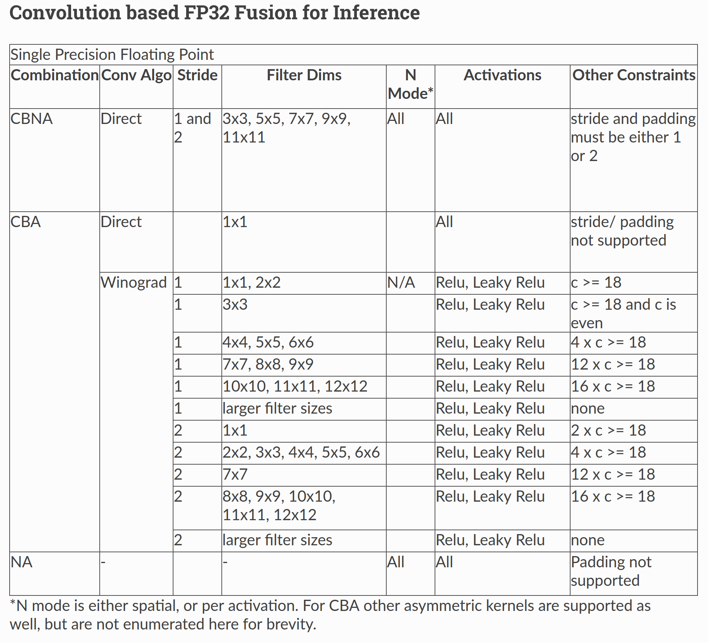
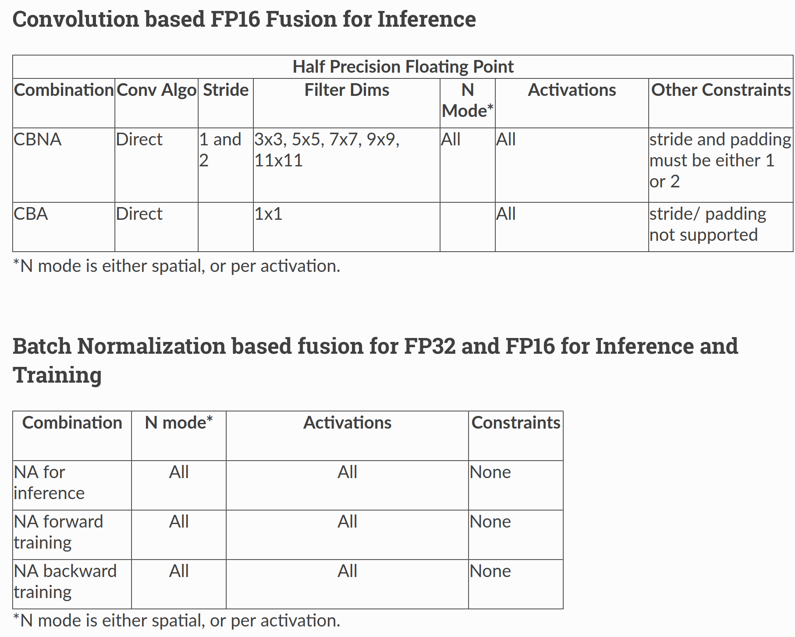

Fusion API: Getting Started
===========================
## Introduction
Increasing depth of deep learning networks necessitate the need for novel mechanisms to improve performance on GPUs. One mechanism to achieve higher efficiency is to _fuse_ separate kernels into a single kernel to reduce off-chip memory access and avoid kernel launch overhead. This document outlines the addition of a Fusion API to the MIOpen library. The fusion API would allow users to specify operators that they wants to fuse in a single kernel, compile it and then launch the kernel. While not all combinations might be supported by the library, the API is flexible enough to allow the specification of many operations in any order from a finite set of supported operations. The API provides a mechanism to report unsupported combinations.

A complete example of the Fusion API in the context of MIOpen is given [here](https://github.com/ROCmSoftwarePlatform/MIOpenExamples/tree/master/fusion). We will use code from the example project as we go along. The example project creates a fusion plan to merge the convolution, bias and activation operations. For a list of supported fusion operations and associated constraints please refer to the [Supported Fusions](#supported_fusions) section. The example depicts bare-bones code without any error checking or even populating the tensors with meaningful data in the interest of simplicity.

The following list outlines the steps required 

- Create a fusion plan
- Create and add the convolution, bias and activation operators
- Compile the Fusion Plan 
- Set the runtime arguments for each operator
- Execute the fusion plan
- Cleanup

The above steps assume that an MIOpen handle object has already been initialized. Moreover, the order in which operators are created is important, since it represents the order of operations on the data itself. Therefore a fusion plan with convolution created before activation is a different fusion plan as opposed to if activation was added before convolution. 

The following sections further elaborate the above steps as well as give code examples to make these ideas concrete.

### Intended Audience
The primary consumers of the fusion API are high level frameworks such as TensorFlow/XLA or PyTorch etc.

## Create a Fusion Plan
A **Fusion Plan** is the data structure which holds all the metadata about the users fusion intent as well as logic to **Compile** and **Execute** a fusion plan. As mentioned earlier, a fusion plan holds the order in which different opertions would be applied on the data, but it also specifies the _axis_ of fusion as well. Currently only **vertical** (sequential) fusions are supported implying the flow of data between operations is sequential.

A fusion plan is created using the API call `miopenCreateFusionPlan` with the signature:

```cpp
miopenStatus_t
miopenCreateFusionPlan(miopenFusionPlanDescriptor_t* fusePlanDesc,
const miopenFusionDirection_t fuseDirection,const miopenTensorDescriptor_t inputDesc);
``` 

The *input tensor descriptor* specifies the geometry of the incoming data. Since the data geometry of the intermediate operations can be derived from the *input tensor descriptor*, therefore only the *input tensor descriptor* is required for the fusion plan and not for the individual operations. In our fusion example the following lines of code accomplish this:
```cpp
miopenCreateFusionPlan(&fusePlanDesc, miopenVerticalFusion, input.desc);
```
Where `fusePlanDesc` is an object of type `miopenFusionPlanDescriptor_t` and `input.desc` is the `miopenTensorDescriptor_t` object.

## Create and add Operators
The fusion API introduces the notion of **operators** which represent different operations that are intended to be fused together by the API consumer. Currently, the API supports the following operators:

*    Convolution Forward
*    Activation Forward
*    BatchNorm Inference
*    Bias Forward

Notice that _Bias_ is a separate operator, although it is typically only used with convolution. This list is expected to grow as support for more operators is added to the API, moreover, operators for backward passes are in the works as well.

The fusion API provides calls for the creation of the supported operators, here we would describe the process for the convolution operator, details for other operators may be found in the [miopen header file](https://rocmsoftwareplatform.github.io/MIOpen/doc/html/fusion.html) 

Once the fusion plan descriptor is created, two or more operators can be added to it by using the individual operator creation API calls. Creation of an operator might fail if the API does not support the fusion of the operations being added and report back immediately to the user. For our example we need to add the Convolution, Bias and Activation operations to our freshly minted fusion plan. This is done using the following calls for the Convolution, Bias and Activation operations respectively:

```cpp
miopenStatus_t
miopenCreateOpConvForward(miopenFusionPlanDescriptor_t fusePlanDesc,
                          miopenFusionOpDescriptor_t* convOp,
                          miopenConvolutionDescriptor_t convDesc,
                          const miopenTensorDescriptor_t wDesc);
miopenStatus_t
miopenCreateOpBiasForward(miopenFusionPlanDescriptor_t fusePlanDesc,
                          miopenFusionOpDescriptor_t* biasOp,
                          const miopenTensorDescriptor_t bDesc);

miopenStatus_t
miopenCreateOpActivationForward(miopenFusionPlanDescriptor_t fusePlanDesc,
                                miopenFusionOpDescriptor_t* activOp,
                                miopenActivationMode_t mode);
```

The following lines in the fusion example project use these API calls to create and insert the operators in the fusion plan:

```cpp
miopenCreateOpConvForward(fusePlanDesc, &convoOp, conv_desc, weights.desc);
miopenCreateOpBiasForward(fusePlanDesc, &biasOp, bias.desc);
miopenCreateOpActivationForward(fusePlanDesc, &activOp, miopenActivationRELU);
```

It may be noted that `conv_desc` is the regular MIOpen Convolution descriptor and is created in the standard way before it is referenced here. For more details on creating and setting the convolution descriptor please refer to the example code as well as the [MIOpen documentation](https://rocmsoftwareplatform.github.io/MIOpen/doc/html/convolution.html). In the above snippet `weights.desc` refers to the `miopenTensorDescriptor_t` for the convolution operations and `bias.desc` refers to the object of the same type for the bias operation. The order of insertion of operators indicates the order in which the operations would be performed on the data. Therefore, the above code implies that the convolution operation would be the first operation to execute on the incoming data, followed by the bias and activation operations. 

During this process, it is important that the returned codes be checked to make sure that the operations as well as their order is supported. The operator insertion might fail for a number of reasons such as unsupported sequence of operations, unsupported dimensions of the input or in case of convolution unsupported dimensions for the filters. In the above example, these aspects are ignored for the sake of simplicity.

## Compile the Fusion Plan

Following the operator addition, the user would compile the fusion plan, to populate the MIOpen kernel cache with the fused kernel and make it ready for execution. The API call that accomplishes this is:

```cpp
miopenStatus_t
miopenCompileFusionPlan(miopenHandle_t handle, miopenFusionPlanDescriptor_t fusePlanDesc);
```

The corresponding code snippet in the example is as follows:

```cpp
auto status = miopenCompileFusionPlan(mio::handle(), fusePlanDesc);
if (status != miopenStatusSuccess) {
return -1;
}
```
In order to compile the fusion plan, the user is assumed to have acquired an MIOpen handle object, in the example code above this is accomplished using the `mio::handle()` helper function. While a fusion plan itself is not bound to a MIOpen handle object, it would however need to be recompiled for each handle separately. It may be noted that compilation of a fusion plan might fail for a number of reasons, moreover it is not assured that a fused version of the kernel would offer any performance improvement over the separately run kernels.

Compiling a fusion plan is a costly operation in terms of run-time. Therefore, it is recommended that a fusion plan should only be compiled once and may be reused for execution with different runtime parameters as described in the next section. 

## Set the runtime arguments

While the underlying MIOpen descriptor of the fusion operator specifies the data geometry and parameters, the fusion plan still needs access to the data to execute a successfully compiled fusion plan. The arguments mechanism in the Fusion API provides such data before a fusion plan may be executed. For example the convolution operator requires *weights* to carry out the convolution computation, a bias operator requires the actual bias values etc. Therefore, before a fusion plan may be executed, arguments required by each fusion operator need to be specified. To begin, we create the `miopenOperatorArgs_t` object using:

```cpp
miopenStatus_t miopenCreateOperatorArgs(miopenOperatorArgs_t* args);
``` 

Once created, runtime arguments for each operation may be set. In our running example, the forward convolution operator requires the convolution weights argument which is supplied using the API call:

```cpp
miopenStatus_t
miopenSetOpArgsConvForward(miopenOperatorArgs_t args,
								const miopenFusionOpDescriptor_t convOp,
                           const void* alpha,
                           const void* beta,
                           const void* w);
```

Similarly the parameters for bias and activation are given by:

```cpp
miopenStatus_t miopenSetOpArgsBiasForward(miopenOperatorArgs_t args,
                                          const miopenFusionOpDescriptor_t biasOp,
                                          const void* alpha,
                                          const void* beta,
                                          const void* bias);
                                          
miopenStatus_t miopenSetOpArgsActivForward(miopenOperatorArgs_t args,
                                           const miopenFusionOpDescriptor_t activOp,
                                           const void* alpha,
                                           const void* beta,
                                           double activAlpha,
                                           double activBeta,
                                           double activGamma);
```

In our example code, we set the arguments for the operations as follows:

```cpp
miopenSetOpArgsConvForward(fusionArgs, convoOp, &alpha, &beta, weights.data);
miopenSetOpArgsActivForward(fusionArgs, activOp, &alpha, &beta, activ_alpha,
                          activ_beta, activ_gamma);
miopenSetOpArgsBiasForward(fusionArgs, biasOp, &alpha, &beta, bias.data);
```

This separation between the fusion plan and the arguments required by each operator allows better reuse of the fusion plan with different argument as well as avoids the necessity of recompiling the fusion plan to run the same combination of operators with different arguments. 

As mentioned in the section [Compile the Fusion Plan](#compile_fusion) earlier, the compilation step for a fusion plan might be costly, therefore a fusion plan should only be compiled once in its lifetime. A fusion plan needs not be recompiled if the input desciptor or any of the parameters to the `miopenCreateOp*` API calls are different, otherwise a compiled fusion plan may be reused again and again with a different set of arguments. In our example this is demonstrated in lines 77 - 85 of `main.cpp`. 

## Execute a Fusion Plan

Once the fusion plan has been compiled and arguments set for each operator, it may be executed with the API call given below passing it the actual data to be processed.

```cpp
miopenStatus_t
miopenExecuteFusionPlan(const miopenHandle_t handle,
                        const miopenFusionPlanDescriptor_t fusePlanDesc,
                        const miopenTensorDescriptor_t inputDesc,
                        const void* input,
                        const miopenTensorDescriptor_t outputDesc,
                        void* output,
                        miopenOperatorArgs_t args);
```

The following code snippet in the example accomplishes the fusion plan execution:

```cpp
miopenExecuteFusionPlan(mio::handle(), fusePlanDesc, input.desc, input.data,
                        output.desc, output.data, fusionArgs);
```

It may be noted that it is an error to attempt to execute a fusion plan that is either not compiled or has been invalidated by changing the input tensor descriptor or any of the operation parameters. 


## Cleanup
Once the application is done with the fusion plan, the fusion plan and the fusion args objects may be destroyed using the API calls:

```cpp
miopenStatus_t miopenDestroyFusionPlan(miopenFusionPlanDescriptor_t fusePlanDesc);
```
Once the fusion plan object is destroyed, all the operations created are destroyed automatically and do not need any special cleanup.


## Supported Fusions 
The tables below outlines the supported fusions for fp32 and fp16 as well as any applicable constraints. **(C = convolution, B = bias, N = batch normalization, A = activation)**
Fusion Plans with grouped convolutions are not supported.








## Performance Comparison to Non-Fused Kernels


The following graph depicts the speedup gained for a fused Convolution+Bias+Activation over a non-fused version, all configurations have a batch size of 64:


Speedup obtained by fusing Batchnorm (spatial mode) with Activation are presented in the graph below:


