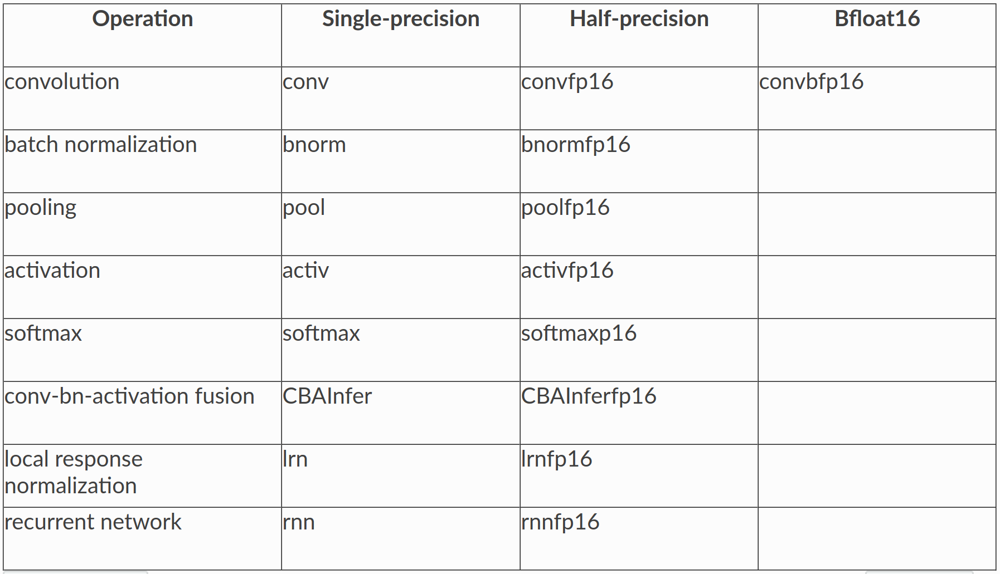

# MIOpenDriver

The `MIOpenDriver` enables the user to test the functionality of any particular 
layer in MIOpen in both the forward and backward direction. MIOpen is shipped with `MIOpenDriver` and its install directory is `miopen/bin` located in the install directory path.


## Building the Driver

MIOpenDriver can be build by typing:

```make MIOpenDriver``` from the ```build``` directory.


## Base Arguments
All the supported layers in MIOpen can be found by the supported `base_args` here:

``` ./lib/miopen/MIOpenDriver --help ```

The supported base arguments:

 * `conv` - Convolutions
 * `CBAInfer` - Convolution+Bias+Activation fusions for inference
 * `pool` - Pooling
 * `lrn` - Local Response Normalization
 * `activ` - Activations
 * `softmax` - Softmax
 * `bnorm` - Batch Normalization
 * `rnn` - Recurrent Neural Networks (including LSTM and GRU)
 * `gemm` - General Matrix Multiplication
 * `ctc` - CTC Loss Function

 These base arguments support fp32 float type, but some of the drivers suport further datatypes -- specifically, half precision (fp16), brain float16 (bfp16), and 8-bit integers (int8).
 To toggle half precision simpily add the suffix `fp16` to end of the base argument; e.g., `convfp16`.
 Likewise, to toggle brain float16 just add the suffix `bfp16`, and to use 8-bit integers add `int8`.

 Notes for this release:
  * Only convolutions support bfp16 and int8
  * RNN's support fp16 but only on the HIP backend
  * CTC loss function only supports fp32

Summary of base_args meant for different datatypes and different operations:




## Executing MIOpenDriver

To execute from the build directory: 

```./lib/miopen/MIOpenDriver *base_arg* *layer_specific_args*```

Or to execute the default configuration simpily run: 

```./lib/miopen/MIOpenDriver *base_arg*```

MIOpenDriver example usages:

- Convolution with search on:

```./lib/miopen/MIOpenDriver conv -W 32 -H 32 -c 3 -k 32 -x 5 -y 5 -p 2 -q 2```

- Forward convolution with search off:

```./lib/miopen/MIOpenDriver conv -W 32 -H 32 -c 3 -k 32 -x 5 -y 5 -p 2 -q 2 -s 0 -F 1```

- Convolution with half or bfloat16 input type

```./lib/miopen/MIOpenDriver convfp16 -W 32 -H 32 -c 3 -k 32 -x 5 -y 5 -p 2 -q 2 -s 0 -F 1```
```./lib/miopen/MIOpenDriver convbfp16 -W 32 -H 32 -c 3 -k 32 -x 5 -y 5 -p 2 -q 2 -s 0 -F 1```

- Pooling with default parameters:

```./lib/miopen/MIOpenDriver pool```

- LRN with default parameters and timing on:

```./lib/miopen/MIOpenDriver lrn -t 1```

- Batch normalization with spatial fwd train, saving mean and variance tensors:

```./lib/miopen/MIOpenDriver bnorm -F 1 -n 32 -c 512 -H 16 -W 16 -m 1 -s 1```

- RNN with forward and backwards pass, no bias, bi-directional and LSTM mode

```./lib/miopen/MIOpenDriver rnn -n 4,4,4,3,3,3,2,2,2,1 -k 10 -H 512 -W 1024 -l 3 -F 0 -b 0 -r 1 -m lstm```

- Printout layer specific input arguments:

`./lib/miopen/MIOpenDriver *base_arg* -?` **OR**  `./lib/miopen/MIOpenDriver *base_arg* -h (--help)`

Note: By default the CPU verification is turned on. Verification can be disabled using `-V 0`.
